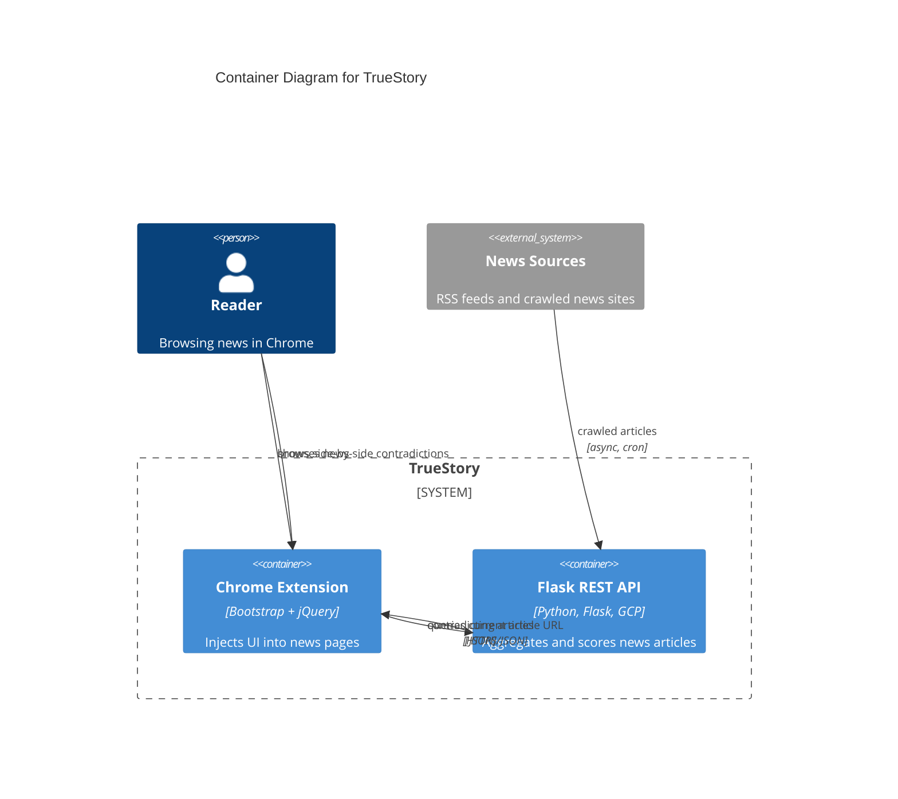

# Mermaid C4 Syntax Reference

Quick reference for the C4 diagram types supported by Mermaid. Use this when generating diagram code in Phase 3.

---

## Diagram types

```
C4Context       — System Context level (users + systems)
C4Container     — Container level (apps, services, databases inside one system)
C4Component     — Component level (internals of one container)
C4Deployment    — Deployment view (infrastructure nodes)
```

Default to `C4Container` unless the brief explicitly says otherwise.

---

## Node primitives

### Persons
```
Person(alias, "Name", "Description")
Person_Ext(alias, "Name", "Description")
```

### Systems (Context level)
```
System(alias, "Name", "Description")
System_Ext(alias, "Name", "Description")
```

### Containers
```
Container(alias, "Name", "Tech", "Description")
Container_Ext(alias, "Name", "Tech", "Description")
ContainerDb(alias, "Name", "Tech", "Description")
ContainerDb_Ext(alias, "Name", "Tech", "Description")
ContainerQueue(alias, "Name", "Tech", "Description")
```

### Components
```
Component(alias, "Name", "Tech", "Description")
Component_Ext(alias, "Name", "Tech", "Description")
```

---

## Boundaries (grouping)

```
System_Boundary(alias, "Label") {
  Container(...)
  ContainerDb(...)
}

Container_Boundary(alias, "Label") {
  Component(...)
}

Enterprise_Boundary(alias, "Label") {
  System(...)
}

Boundary(alias, "Label", "type") {
  ...
}
```

Boundaries are visual groupings only. They do not affect edge routing.

---

## Relationships

```
Rel(from, to, "label")                  — generic relationship
Rel(from, to, "label", "technology")    — with protocol/tech annotation
Rel_D(from, to, "label")               — force downward direction
Rel_U(from, to, "label")               — force upward
Rel_L(from, to, "label")               — force left
Rel_R(from, to, "label")               — force right
Rel_Back(from, to, "label")            — reverse direction arrow
Rel_Neighbor(from, to, "label")        — same-rank placement hint
BiRel(from, to, "label")               — bidirectional (AVOID: use two Rel instead)
```

Never use `BiRel`. Always use two separate `Rel` calls with distinct labels.

---

## Layout configuration

```
UpdateLayoutConfig($c4ShapeInRow="3", $c4BoundaryInRow="1")
```

Controls how many shapes per row and boundaries per row. Adjust based on node count:
- 3-5 nodes: `$c4ShapeInRow="3"`
- 6-9 nodes: `$c4ShapeInRow="3"` or `"4"`
- 10+: consider splitting into multiple diagrams

---

## Style overrides

```
UpdateElementStyle(alias, $fontColor="white", $bgColor="#00897B", $borderColor="#006B5E")
UpdateRelStyle(from, to, $textColor="#555", $lineColor="#555", $offsetY="-10")
```

Use sparingly. Prefer the color palette defined in `color-palette.md`.

---

## Complete example: TrueStory (brief #7)

This is the simplest brief (5 nodes, 5 edges), good for validating syntax.


