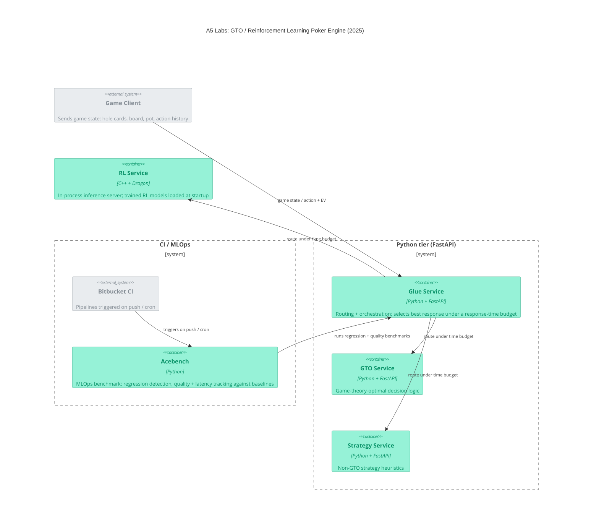

# A5 Labs: GTO / Reinforcement Learning Poker Engine (2025) — Container Diagram

Three sibling decision services sit behind a Glue router: GTO (game-theory-optimal), Strategy (non-GTO heuristics), and an RL Service that doubles as the C++ inference server with trained models loaded at startup. Glue picks the best response under a time budget. Acebench, a Python MLOps benchmark, exercises the full stack via Bitbucket CI pipelines to detect regressions and track quality/latency against historical baselines.

