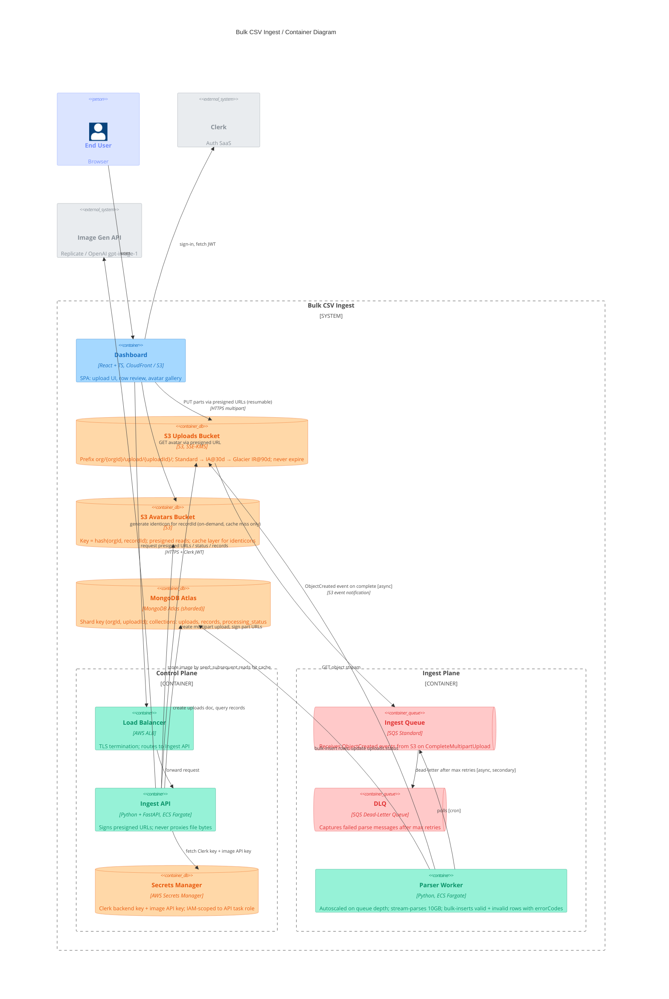

# Bulk CSV Ingest / Container Diagram

```mermaid
C4Container
  title Bulk CSV Ingest / Container Diagram

  Person(user, "End User", "Browser", "Uploads CSV/XLSX, reviews rows, triggers avatar gen")
  System_Ext(clerk, "Clerk", "Auth SaaS", "Hosted auth: orgs, roles, JWT; API verifies tokens")
  System_Ext(imageapi, "Image Gen API", "Replicate / OpenAI gpt-image-1", "Identicon-style prompts; deterministic seed = hash(orgId, recordId)")

  System_Boundary(bcsv, "Bulk CSV Ingest") {

    Container(dashboard, "Dashboard", "React + TS, CloudFront / S3", "SPA: upload UI, row review, avatar gallery")

    Container_Boundary(bcp, "Control Plane") {
      Container(alb, "Load Balancer", "AWS ALB", "TLS termination; routes to Ingest API")
      Container(api, "Ingest API", "Python + FastAPI, ECS Fargate", "Signs presigned URLs; never proxies file bytes")
      ContainerDb(secrets, "Secrets Manager", "AWS Secrets Manager", "Clerk backend key + image API key; IAM-scoped to API task role")
    }

    ContainerDb(s3uploads, "S3 Uploads Bucket", "S3, SSE-KMS", "Prefix org/{orgId}/upload/{uploadId}/; Standard → IA@30d → Glacier IR@90d; never expire")
    ContainerDb(s3avatars, "S3 Avatars Bucket", "S3", "Key = hash(orgId, recordId); presigned reads; cache layer for identicons")

    Container_Boundary(bip, "Ingest Plane") {
      ContainerQueue(sqs, "Ingest Queue", "SQS Standard", "Receives ObjectCreated events from S3 on CompleteMultipartUpload")
      ContainerQueue(dlq, "DLQ", "SQS Dead-Letter Queue", "Captures failed parse messages after max retries")
      Container(parser, "Parser Worker", "Python, ECS Fargate", "Autoscaled on queue depth; stream-parses 10GB; bulk-inserts valid + invalid rows with errorCodes")
    }

    ContainerDb(mongo, "MongoDB Atlas", "MongoDB Atlas (sharded)", "Shard key (orgId, uploadId); collections: uploads, records, processing_status")

  }

  %% --- Edges ---

  Rel(user, dashboard, "uses")
  Rel(dashboard, clerk, "sign-in, fetch JWT")
  Rel(dashboard, alb, "request presigned URLs / status / records", "HTTPS + Clerk JWT")
  Rel(alb, api, "forward request")
  Rel(api, secrets, "fetch Clerk key + image API key")
  Rel(api, s3uploads, "create multipart upload, sign part URLs")
  Rel(api, mongo, "create uploads doc, query records")
  Rel(dashboard, s3uploads, "PUT parts via presigned URLs (resumable)", "HTTPS multipart")
  %% S3 event notification is an active AWS push — justified exception to passive-store rule
  Rel(s3uploads, sqs, "ObjectCreated event on complete [async]", "S3 event notification")
  %% Parser polls SQS (consumer → producer per pull-direction rule)
  Rel(parser, sqs, "polls [cron]")
  Rel(parser, s3uploads, "GET object stream")
  Rel(parser, mongo, "bulk-insert rows; update uploads.status")
  %% DLQ routing is AWS-internal SQS behavior — same justified exception as s3uploads → sqs
  Rel(sqs, dlq, "dead-letter after max retries [async, secondary]")
  Rel(api, imageapi, "generate identicon for recordId (on-demand, cache miss only)")
  Rel(api, s3avatars, "store image by seed; subsequent reads hit cache")
  Rel(dashboard, s3avatars, "GET avatar via presigned URL")

  %% --- Styles ---

  UpdateElementStyle(user, $fontColor="#748ffc", $bgColor="#dbe4ff", $borderColor="#748ffc")
  UpdateElementStyle(dashboard, $fontColor="#1971c2", $bgColor="#a5d8ff", $borderColor="#1971c2")
  UpdateElementStyle(clerk, $fontColor="#868e96", $bgColor="#e9ecef", $borderColor="#868e96")
  UpdateElementStyle(imageapi, $fontColor="#868e96", $bgColor="#e9ecef", $borderColor="#868e96")
  UpdateElementStyle(alb, $fontColor="#099268", $bgColor="#96f2d7", $borderColor="#099268")
  UpdateElementStyle(api, $fontColor="#099268", $bgColor="#96f2d7", $borderColor="#099268")
  UpdateElementStyle(secrets, $fontColor="#e8590c", $bgColor="#ffd8a8", $borderColor="#e8590c")
  UpdateElementStyle(s3uploads, $fontColor="#e8590c", $bgColor="#ffd8a8", $borderColor="#e8590c")
  UpdateElementStyle(s3avatars, $fontColor="#e8590c", $bgColor="#ffd8a8", $borderColor="#e8590c")
  UpdateElementStyle(sqs, $fontColor="#e03131", $bgColor="#ffc9c9", $borderColor="#e03131")
  UpdateElementStyle(dlq, $fontColor="#e03131", $bgColor="#ffc9c9", $borderColor="#e03131")
  UpdateElementStyle(parser, $fontColor="#099268", $bgColor="#96f2d7", $borderColor="#099268")
  UpdateElementStyle(mongo, $fontColor="#e8590c", $bgColor="#ffd8a8", $borderColor="#e8590c")

  UpdateLayoutConfig($c4ShapeInRow="4", $c4BoundaryInRow="2")
```
