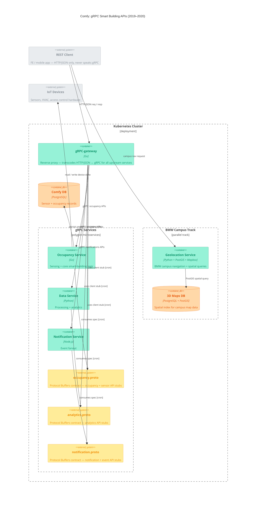

# Comfy: gRPC Smart Building APIs (2019–2020) / Container Diagram

```mermaid
C4Container
  title Comfy: gRPC Smart Building APIs (2019–2020)

  System_Ext(restClient, "REST Client", "FE / mobile app — HTTP/JSON only, never speaks gRPC")
  System_Ext(iot, "IoT Devices", "Sensors, HVAC, access control hardware")

  UpdateElementStyle(restClient, $fontColor="#868e96", $bgColor="#e9ecef", $borderColor="#868e96")
  UpdateElementStyle(iot, $fontColor="#868e96", $bgColor="#e9ecef", $borderColor="#868e96")

  Boundary(k8s, "Kubernetes Cluster", "deployment") {

    Container(gateway, "gRPC-gateway", "Go", "Reverse proxy — transcodes HTTP/JSON ↔ gRPC for all upstream services")
    UpdateElementStyle(gateway, $fontColor="#099268", $bgColor="#96f2d7", $borderColor="#099268")

    ContainerDb(db, "Comfy DB", "PostgreSQL", "Sensor + occupancy records")
    UpdateElementStyle(db, $fontColor="#e8590c", $bgColor="#ffd8a8", $borderColor="#e8590c")

    Boundary(grpcSvcs, "gRPC Services", "polyglot microservices") {
      Container(goSvc, "Occupancy Service", "Go", "Sensing + core smart-building logic")
      UpdateElementStyle(goSvc, $fontColor="#099268", $bgColor="#96f2d7", $borderColor="#099268")

      Container(pySvc, "Data Service", "Python", "Processing + analytics")
      UpdateElementStyle(pySvc, $fontColor="#099268", $bgColor="#96f2d7", $borderColor="#099268")

      Container(nodeSvc, "Notification Service", "Node.js", "Event fanout")
      UpdateElementStyle(nodeSvc, $fontColor="#099268", $bgColor="#96f2d7", $borderColor="#099268")

      System_Ext(protoOcc, "occupancy.proto", "Protocol Buffers contract — occupancy + sensor API stubs")
      UpdateElementStyle(protoOcc, $fontColor="#f08c00", $bgColor="#ffec99", $borderColor="#f08c00")

      System_Ext(protoData, "analytics.proto", "Protocol Buffers contract — analytics API stubs")
      UpdateElementStyle(protoData, $fontColor="#f08c00", $bgColor="#ffec99", $borderColor="#f08c00")

      System_Ext(protoNotif, "notification.proto", "Protocol Buffers contract — notification + event API stubs")
      UpdateElementStyle(protoNotif, $fontColor="#f08c00", $bgColor="#ffec99", $borderColor="#f08c00")
    }

    Boundary(bmw, "BMW Campus Track", "parallel track") {
      Container(geoSvc, "Geolocation Service", "Python + PostGIS + Mapbox", "BMW campus navigation + spatial queries")
      UpdateElementStyle(geoSvc, $fontColor="#099268", $bgColor="#96f2d7", $borderColor="#099268")

      ContainerDb(geoDb, "3D Maps DB", "PostgreSQL + PostGIS", "Spatial index for campus map data")
      UpdateElementStyle(geoDb, $fontColor="#e8590c", $bgColor="#ffd8a8", $borderColor="#e8590c")
    }
  }

  %% Runtime edges
  Rel(restClient, gateway, "HTTP/JSON req / resp")
  Rel(gateway, goSvc, "gRPC: occupancy APIs")
  Rel(gateway, pySvc, "gRPC: analytics APIs")
  Rel(gateway, nodeSvc, "gRPC: notifications APIs")
  Rel(goSvc, iot, "read / write device state")
  Rel(goSvc, db, "persist sensor + occupancy data")
  Rel(restClient, geoSvc, "campus nav request")
  Rel(geoSvc, geoDb, "PostGIS spatial query")

  %% Build-time dependencies (consumers → spec)
  Rel(gateway, protoOcc, "uses client stub [cron]")
  Rel(gateway, protoData, "uses client stub [cron]")
  Rel(gateway, protoNotif, "uses client stub [cron]")
  Rel(goSvc, protoOcc, "consumes spec [cron]")
  Rel(pySvc, protoData, "consumes spec [cron]")
  Rel(nodeSvc, protoNotif, "consumes spec [cron]")

  UpdateLayoutConfig($c4ShapeInRow="3", $c4BoundaryInRow="2")
```
