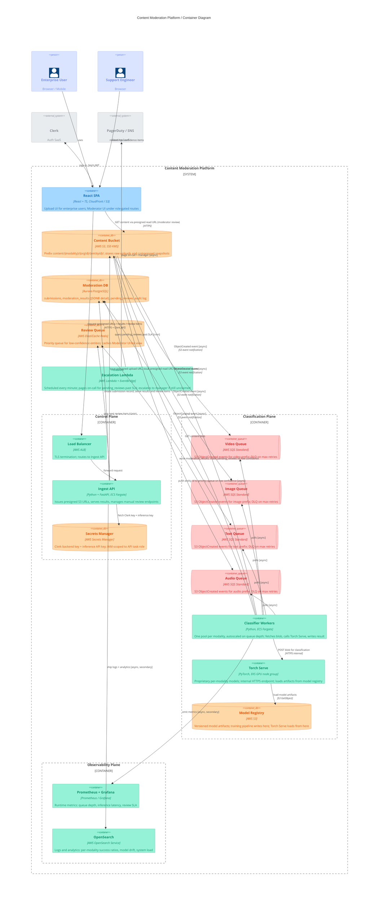

# Content Moderation Platform / Container Diagram

```mermaid
C4Container
  title Content Moderation Platform / Container Diagram

  Person(enterprise_user, "Enterprise User", "Browser / Mobile", "Uploads content, tracks moderation results")
  Person(moderator, "Support Engineer", "Browser", "Reviews low-confidence items; binary-decides harmful or not")
  System_Ext(clerk, "Clerk", "Auth SaaS", "Hosted auth: orgs, roles, JWT; API verifies tokens")
  System_Ext(pagerduty, "PagerDuty / SNS", "Alerting SaaS", "On-call pages for stalled reviews past SLA")

  System_Boundary(cm, "Content Moderation Platform") {

    Container(spa, "React SPA", "React + TS, CloudFront / S3", "Upload UI for enterprise users; Moderator UI under role-gated routes")

    Container_Boundary(bcp, "Control Plane") {
      Container(alb, "Load Balancer", "AWS ALB", "TLS termination; routes to Ingest API")
      Container(api, "Ingest API", "Python + FastAPI, ECS Fargate", "Issues presigned S3 URLs, serves results, manages manual review endpoints")
      ContainerDb(secrets, "Secrets Manager", "AWS Secrets Manager", "Clerk backend key + inference API key; IAM-scoped to API task role")
    }

    ContainerDb(s3raw, "Content Bucket", "AWS S3, SSE-KMS", "Prefix content/{modality}/{orgId}/{entityId}/; stores raw uploads and compressed snapshots")
    ContainerDb(postgres, "Moderation DB", "Aurora PostgreSQL", "submissions, moderation_results (JSONB detail), pending_reviews, audit log")
    ContainerDb(redis, "Review Queue", "AWS ElastiCache Redis", "Priority queue for low-confidence entities; caches Moderator UI list view")

    Container_Boundary(bclass, "Classification Plane") {
      ContainerQueue(sqs_video, "Video Queue", "AWS SQS Standard", "S3 ObjectCreated events for video prefix; DLQ on max retries")
      ContainerQueue(sqs_img, "Image Queue", "AWS SQS Standard", "S3 ObjectCreated events for image prefix; DLQ on max retries")
      ContainerQueue(sqs_text, "Text Queue", "AWS SQS Standard", "S3 ObjectCreated events for text prefix; DLQ on max retries")
      ContainerQueue(sqs_audio, "Audio Queue", "AWS SQS Standard", "S3 ObjectCreated events for audio prefix; DLQ on max retries")
      Container(workers, "Classifier Workers", "Python, ECS Fargate", "One pool per modality, autoscaled on queue depth; fetches blob, calls Torch Serve, writes result")
      Container(torchserve, "Torch Serve", "PyTorch, EKS GPU node group", "Proprietary per-modality models; internal HTTPS endpoint; loads artifacts from model registry")
      ContainerDb(model_registry, "Model Registry", "AWS S3", "Versioned model artifacts; training pipeline writes here; Torch Serve loads from here")
    }

    Container_Boundary(bobs, "Observability Plane") {
      Container(prometheus, "Prometheus + Grafana", "Prometheus / Grafana", "Runtime metrics: queue depth, inference latency, review SLA")
      Container(opensearch, "OpenSearch", "AWS OpenSearch Service", "Logs and analytics: per-modality success ratios, model drift, system load")
    }

    Container(escalation, "Escalation Lambda", "AWS Lambda + EventBridge", "Scheduled every minute; pages on-call for pending_reviews past SLA; escalates to manager if still unclaimed")

  }

  %% --- Edges ---

  Rel(enterprise_user, spa, "uses")
  Rel(moderator, spa, "reviews low-confidence items")
  Rel(spa, clerk, "sign-in, fetch JWT")
  Rel(spa, alb, "request presigned URLs / results / review items", "HTTPS + Clerk JWT")
  Rel(alb, api, "forward request")
  Rel(api, secrets, "fetch Clerk key + inference key")
  Rel(api, s3raw, "issue presigned upload URL; issue presigned read URL for moderator review")
  Rel(api, postgres, "create submission record; serve results and review items")
  Rel(api, redis, "pop next review item (claim)")
  Rel(spa, s3raw, "PUT content via presigned URL (resumable)", "HTTPS multipart or PUT")
  Rel(spa, s3raw, "GET content via presigned read URL (moderator review)", "HTTPS")
  %% S3 ObjectCreated events are an active AWS push
  Rel(s3raw, sqs_video, "ObjectCreated event [async]", "S3 event notification")
  Rel(s3raw, sqs_img, "ObjectCreated event [async]", "S3 event notification")
  Rel(s3raw, sqs_text, "ObjectCreated event [async]", "S3 event notification")
  Rel(s3raw, sqs_audio, "ObjectCreated event [async]", "S3 event notification")
  Rel(workers, sqs_video, "polls [async]")
  Rel(workers, sqs_img, "polls [async]")
  Rel(workers, sqs_text, "polls [async]")
  Rel(workers, sqs_audio, "polls [async]")
  Rel(workers, s3raw, "GET content blob")
  Rel(workers, torchserve, "POST blob for classification", "HTTPS internal")
  Rel(workers, postgres, "write moderation_results; insert pending_reviews on low confidence")
  Rel(workers, redis, "push entity id to priority queue on low confidence [async]")
  Rel(torchserve, model_registry, "load model artifacts", "S3 GetObject")
  Rel(escalation, postgres, "query pending_reviews past SLA [cron]")
  Rel(escalation, pagerduty, "page on-call + manager [async]")
  Rel(workers, prometheus, "emit metrics [async, secondary]")
  Rel(api, opensearch, "ship logs + analytics [async, secondary]")

  %% --- Styles ---

  UpdateElementStyle(enterprise_user, $fontColor="#748ffc", $bgColor="#dbe4ff", $borderColor="#748ffc")
  UpdateElementStyle(moderator, $fontColor="#748ffc", $bgColor="#dbe4ff", $borderColor="#748ffc")
  UpdateElementStyle(spa, $fontColor="#1971c2", $bgColor="#a5d8ff", $borderColor="#1971c2")
  UpdateElementStyle(clerk, $fontColor="#868e96", $bgColor="#e9ecef", $borderColor="#868e96")
  UpdateElementStyle(pagerduty, $fontColor="#868e96", $bgColor="#e9ecef", $borderColor="#868e96")
  UpdateElementStyle(alb, $fontColor="#099268", $bgColor="#96f2d7", $borderColor="#099268")
  UpdateElementStyle(api, $fontColor="#099268", $bgColor="#96f2d7", $borderColor="#099268")
  UpdateElementStyle(workers, $fontColor="#099268", $bgColor="#96f2d7", $borderColor="#099268")
  UpdateElementStyle(torchserve, $fontColor="#099268", $bgColor="#96f2d7", $borderColor="#099268")
  UpdateElementStyle(escalation, $fontColor="#099268", $bgColor="#96f2d7", $borderColor="#099268")
  UpdateElementStyle(prometheus, $fontColor="#099268", $bgColor="#96f2d7", $borderColor="#099268")
  UpdateElementStyle(opensearch, $fontColor="#099268", $bgColor="#96f2d7", $borderColor="#099268")
  UpdateElementStyle(secrets, $fontColor="#e8590c", $bgColor="#ffd8a8", $borderColor="#e8590c")
  UpdateElementStyle(s3raw, $fontColor="#e8590c", $bgColor="#ffd8a8", $borderColor="#e8590c")
  UpdateElementStyle(postgres, $fontColor="#e8590c", $bgColor="#ffd8a8", $borderColor="#e8590c")
  UpdateElementStyle(redis, $fontColor="#e8590c", $bgColor="#ffd8a8", $borderColor="#e8590c")
  UpdateElementStyle(model_registry, $fontColor="#e8590c", $bgColor="#ffd8a8", $borderColor="#e8590c")
  UpdateElementStyle(sqs_video, $fontColor="#e03131", $bgColor="#ffc9c9", $borderColor="#e03131")
  UpdateElementStyle(sqs_img, $fontColor="#e03131", $bgColor="#ffc9c9", $borderColor="#e03131")
  UpdateElementStyle(sqs_text, $fontColor="#e03131", $bgColor="#ffc9c9", $borderColor="#e03131")
  UpdateElementStyle(sqs_audio, $fontColor="#e03131", $bgColor="#ffc9c9", $borderColor="#e03131")

  UpdateLayoutConfig($c4ShapeInRow="4", $c4BoundaryInRow="2")
```
