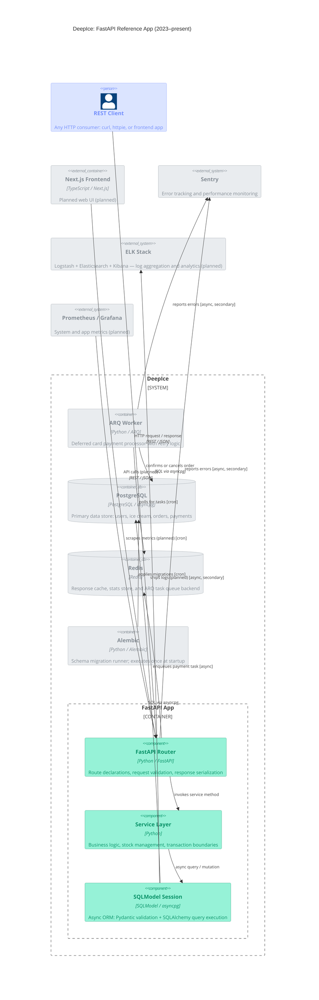

# DeepIce: FastAPI Reference App (2023–present) — Component Diagram

```mermaid
C4Component
  title DeepIce: FastAPI Reference App (2023–present)

  Person(client, "REST Client", "Any HTTP consumer: curl, httpie, or frontend app")
  Container_Ext(nextjs, "Next.js Frontend", "TypeScript / Next.js", "Planned web UI (planned)")

  System_Boundary(deepice, "DeepIce") {
    Container_Boundary(fastapi, "FastAPI App") {
      Component(router, "FastAPI Router", "Python / FastAPI", "Route declarations, request validation, response serialization")
      Component(service, "Service Layer", "Python", "Business logic, stock management, transaction boundaries")
      Component(session, "SQLModel Session", "SQLModel / asyncpg", "Async ORM: Pydantic validation + SQLAlchemy query execution")
    }
    Container(worker, "ARQ Worker", "Python / ARQ", "Deferred card payment processor with retry logic")
    ContainerDb(postgres, "PostgreSQL", "PostgreSQL / asyncpg", "Primary data store: users, ice cream, orders, payments")
    ContainerDb(redis, "Redis", "Redis", "Response cache, stats store, and ARQ task queue backend")
    Container(alembic, "Alembic", "Python / Alembic", "Schema migration runner; executes once at startup")
  }

  System_Ext(sentry, "Sentry", "Error tracking and performance monitoring")
  System_Ext(elk, "ELK Stack", "Logstash + Elasticsearch + Kibana — log aggregation and analytics (planned)")
  System_Ext(prometheus, "Prometheus / Grafana", "System and app metrics (planned)")

  Rel(client, router, "HTTP request / response", "REST / JSON")
  Rel(router, redis, "cache lookup / stats write")
  Rel(router, service, "invokes service method")
  Rel(service, session, "async query / mutation")
  Rel(session, postgres, "SQL via asyncpg")
  Rel(router, redis, "enqueues payment task [async]")
  Rel(worker, redis, "polls for tasks [cron]")
  Rel(worker, postgres, "confirms or cancels order", "SQL via asyncpg")
  Rel(alembic, postgres, "applies migrations [cron]")
  Rel(router, sentry, "reports errors [async, secondary]")
  Rel(worker, sentry, "reports errors [async, secondary]")
  Rel(nextjs, router, "API calls (planned)", "REST / JSON")
  Rel(session, elk, "ships logs (planned) [async, secondary]")
  Rel(prometheus, router, "scrapes metrics (planned) [cron]")

  UpdateElementStyle(router, $fontColor="#099268", $bgColor="#96f2d7", $borderColor="#099268")
  UpdateElementStyle(service, $fontColor="#099268", $bgColor="#96f2d7", $borderColor="#099268")
  UpdateElementStyle(session, $fontColor="#099268", $bgColor="#96f2d7", $borderColor="#099268")
  UpdateElementStyle(client, $fontColor="#748ffc", $bgColor="#dbe4ff", $borderColor="#748ffc")
  UpdateElementStyle(worker, $fontColor="#868e96", $bgColor="#e9ecef", $borderColor="#868e96")
  UpdateElementStyle(postgres, $fontColor="#868e96", $bgColor="#e9ecef", $borderColor="#868e96")
  UpdateElementStyle(redis, $fontColor="#868e96", $bgColor="#e9ecef", $borderColor="#868e96")
  UpdateElementStyle(alembic, $fontColor="#868e96", $bgColor="#e9ecef", $borderColor="#868e96")
  UpdateElementStyle(sentry, $fontColor="#868e96", $bgColor="#e9ecef", $borderColor="#868e96")
  UpdateElementStyle(nextjs, $fontColor="#868e96", $bgColor="#e9ecef", $borderColor="#868e96")
  UpdateElementStyle(elk, $fontColor="#868e96", $bgColor="#e9ecef", $borderColor="#868e96")
  UpdateElementStyle(prometheus, $fontColor="#868e96", $bgColor="#e9ecef", $borderColor="#868e96")

  UpdateLayoutConfig($c4ShapeInRow="3", $c4BoundaryInRow="1")
```
