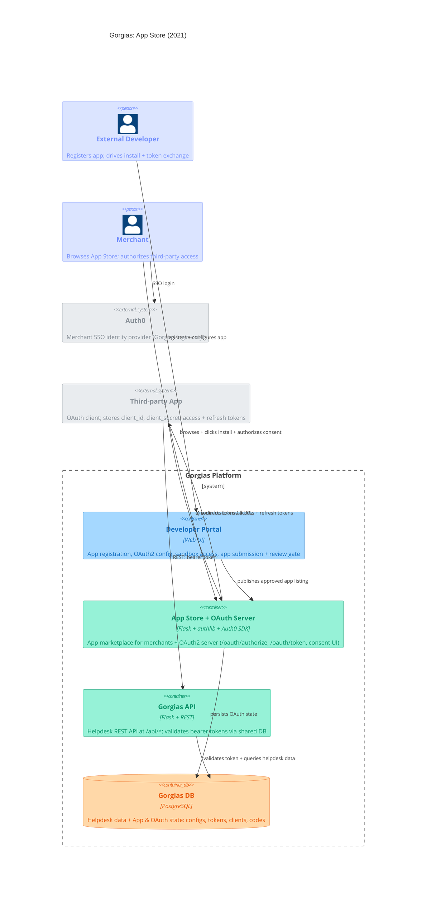

# Gorgias: App Store (2021) — Container Diagram

Gorgias runs its own OAuth2 Authorization Code Grant server (Flask + authlib), enabling third-party developers to build integrations that connect external services with the Gorgias helpdesk platform. Developers register via the Developer Portal to obtain a `client_id` and `client_secret`, then submit their app through a review gate before it appears in the App Store for merchants to install. The Developer Portal is a Web UI — all writes go through the App Store Flask backend. Auth0 sits alongside as the merchant SSO identity layer, not part of the third-party OAuth issuance. PostgreSQL stores helpdesk data plus app and OAuth state (app configs, tokens with revocation, OAuth clients, authorization codes).

The install flow splits into two labeled steps: a) App Store redirects the merchant's browser to the third-party install URL; b) the third-party app drives a front-channel browser redirect to `/oauth/authorize` and receives an authorization code; c) back-channel server-to-server POST to `/oauth/token` exchanges the code for `access_token` + `refresh_token`. Once a token is issued, the third-party app calls the Gorgias API directly.

