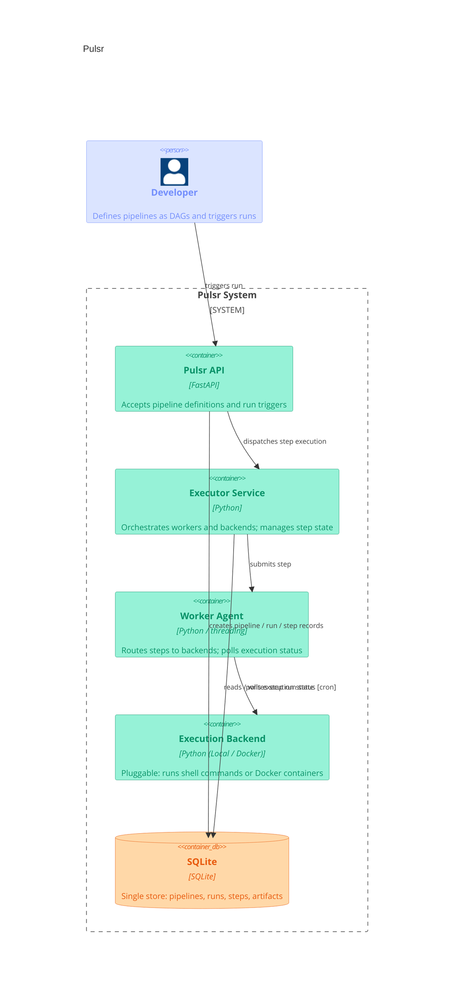

# Pulsr — Container Diagram

```mermaid
C4Container
  title Pulsr

  Person(user, "Developer", "Defines pipelines as DAGs and triggers runs")

  System_Boundary(pulsr, "Pulsr System") {
    Container(api, "Pulsr API", "FastAPI", "Accepts pipeline definitions and run triggers")
    Container(executor, "Executor Service", "Python", "Orchestrates workers and backends; manages step state")
    Container(worker, "Worker Agent", "Python / threading", "Routes steps to backends; polls execution status")
    Container(backend, "Execution Backend", "Python (Local / Docker)", "Pluggable: runs shell commands or Docker containers")
    ContainerDb(db, "SQLite", "SQLite", "Single store: pipelines, runs, steps, artifacts")
  }

  Rel(user, api, "defines pipeline (DAG)")
  Rel(user, api, "triggers run")
  Rel(api, db, "creates pipeline / run / step records")
  Rel(api, executor, "dispatches step execution")
  Rel(executor, db, "reads / writes step run state")
  Rel(executor, worker, "submits step")
  Rel(worker, backend, "runs step command [async]")
  Rel(worker, backend, "polls execution status [cron]")

  UpdateElementStyle(user, $bgColor="#dbe4ff", $borderColor="#748ffc", $fontColor="#748ffc")
  UpdateElementStyle(api, $bgColor="#96f2d7", $borderColor="#099268", $fontColor="#099268")
  UpdateElementStyle(executor, $bgColor="#96f2d7", $borderColor="#099268", $fontColor="#099268")
  UpdateElementStyle(worker, $bgColor="#96f2d7", $borderColor="#099268", $fontColor="#099268")
  UpdateElementStyle(backend, $bgColor="#96f2d7", $borderColor="#099268", $fontColor="#099268")
  UpdateElementStyle(db, $bgColor="#ffd8a8", $borderColor="#e8590c", $fontColor="#e8590c")

  UpdateLayoutConfig($c4ShapeInRow="4", $c4BoundaryInRow="1")
```
