# RPA Framework & Automation Libraries — Container Diagram (2021–2024)

Developer authors a task package, RCC builds the environment and runs it, `robocorp-tasks` dispatches into the automation library layer, and Control Room orchestrates runs at scale. Portal (example-\* repos on GitHub) feeds both the developer and RCC's `rcc pull` command.

```mermaid
C4Container
  title RPA Framework & Automation Libraries (2021–2024)

  Person(dev, "Developer", "Automation engineer authoring robots")
  System_Ext(portal, "robocorp.com/portal + example-* repos", "Gallery of pullable example robots hosted on GitHub")
  System_Ext(targets, "Target Systems", "Web apps, desktop apps, cloud SaaS, filesystems, ERPs")
  System_Ext(controlRoom, "Control Room", "Enterprise orchestration: scheduling, secrets, scaling")

  Container(rcc, "RCC CLI", "Go; OSS", "Self-contained Python envs; rcc pull / run / cloud push")
  Container(taskPkg, "Task Package", "robot.yaml + conda.yaml + tasks.py", "One-robot deployable unit")
  Container(tasks, "robocorp-tasks", "Python", "@task decorator — entry point + logging bootstrap")

  Boundary(libs, "Automation Libraries (OSS on GitHub, published to PyPI — robocorp-* + rpaframework-*)", "system") {
    Container(libBrowser, "Browser lib", "robocorp-browser / rpaframework (Selenium + Playwright)", "Web automation")
    Container(libDesktop, "Desktop lib", "robocorp-windows / rpaframework-windows", "Desktop automation")
    Container(libDocs, "Docs + OCR lib", "rpaframework-pdf + rpaframework-recognition", "PDF parsing + screen OCR")
    Container(libCloud, "Cloud integrations", "rpaframework-aws / -google / -openai / -hubspot", "Managed API wrappers")
    Container(libData, "Data plumbing", "robocorp-workitems + -vault + -storage", "Work items, secrets, cloud storage")
    Container(libLog, "robocorp-log", "Python", "Structured execution logging")
  }

  ContainerDb(artifacts, "log.html + artifacts", "File", "Run report, screenshots, extracted data")

  Rel(dev, portal, "browses example repos")
  Rel(dev, rcc, "rcc pull / rcc run / rcc cloud push")
  Rel(dev, taskPkg, "authors")
  Rel(rcc, portal, "rcc pull example-* repos")
  Rel(rcc, taskPkg, "builds env + executes")
  Rel(rcc, controlRoom, "submits + pushes")
  Rel(controlRoom, rcc, "schedules + triggers [async]")
  Rel(taskPkg, tasks, "imports @task")
  Rel(tasks, libBrowser, "dispatch")
  Rel(tasks, libDesktop, "dispatch")
  Rel(tasks, libDocs, "dispatch")
  Rel(tasks, libCloud, "dispatch")
  Rel(tasks, libData, "dispatch")
  Rel(tasks, libLog, "writes log events")
  Rel(libBrowser, targets, "browser actions")
  Rel(libDesktop, targets, "desktop actions")
  Rel(libDocs, targets, "document + screen")
  Rel(libCloud, targets, "API calls")
  Rel(libData, targets, "fetch/write work items + secrets")
  Rel(libLog, artifacts, "log.html + screenshots [async]")

  UpdateElementStyle(dev, $bgColor="#dbe4ff", $borderColor="#748ffc", $fontColor="#748ffc")
  UpdateElementStyle(rcc, $bgColor="#96f2d7", $borderColor="#099268", $fontColor="#099268")
  UpdateElementStyle(taskPkg, $bgColor="#96f2d7", $borderColor="#099268", $fontColor="#099268")
  UpdateElementStyle(tasks, $bgColor="#96f2d7", $borderColor="#099268", $fontColor="#099268")
  UpdateElementStyle(libBrowser, $bgColor="#96f2d7", $borderColor="#099268", $fontColor="#099268")
  UpdateElementStyle(libDesktop, $bgColor="#96f2d7", $borderColor="#099268", $fontColor="#099268")
  UpdateElementStyle(libDocs, $bgColor="#96f2d7", $borderColor="#099268", $fontColor="#099268")
  UpdateElementStyle(libCloud, $bgColor="#96f2d7", $borderColor="#099268", $fontColor="#099268")
  UpdateElementStyle(libData, $bgColor="#96f2d7", $borderColor="#099268", $fontColor="#099268")
  UpdateElementStyle(libLog, $bgColor="#96f2d7", $borderColor="#099268", $fontColor="#099268")
  UpdateElementStyle(artifacts, $bgColor="#ffd8a8", $borderColor="#e8590c", $fontColor="#e8590c")
```

