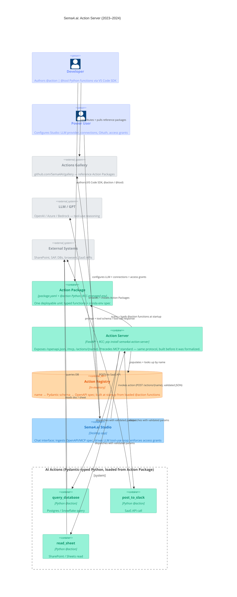

# Sema4.ai: Action Server (2023–2024) — Container Diagram

Developer authors typed `@action` Python functions inside an Action Package; Action Server scans them, builds a Pydantic-backed OpenAPI spec, and exposes FastAPI endpoints. Sema4.ai Studio (Desktop chat app) ingests that spec, routes the user's chat intent to an LLM for tool-use reasoning, then invokes the matching action. Power User configures Studio: LLM provider, OAuth connections, and access grants between Studio and external systems. The Actions Gallery (GitHub) feeds both Developer and Studio with ready-made Action Packages. This design predates MCP but maps directly onto it.

