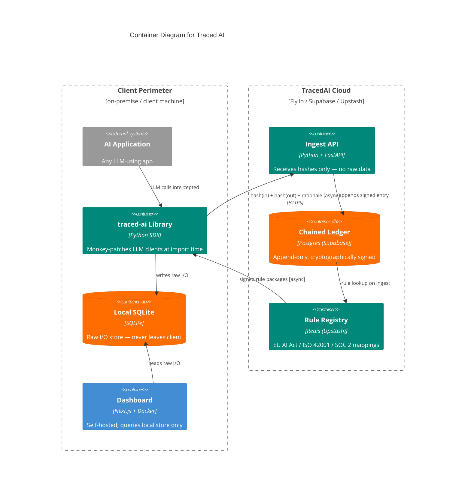

# Traced AI — Container Diagram (2024–present)

<!-- Abstraction level: Container (C4)
     Two boundaries rendered side-by-side: client perimeter (left) vs TracedAI cloud (right).
     Boundaries are load-bearing here — the entire value prop is what stays local vs. what crosses the network.
     Directional Rel hints omitted to avoid layout collapse (layout-001).
     Signed Rule Packages modeled as an edge label (not a separate node) — it is a delivery mechanism, not a service.
-->

