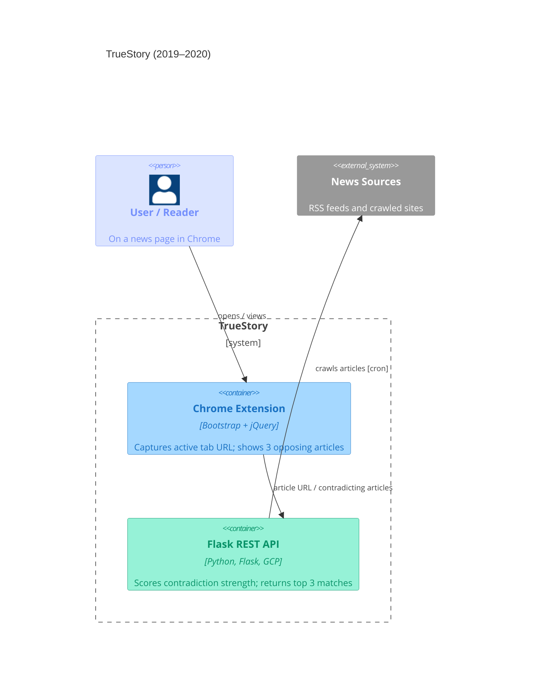

# TrueStory (2019–2020) — Container Diagram

```mermaid
C4Container
  title TrueStory (2019–2020)

  Person(user, "User / Reader", "On a news page in Chrome")

  Boundary(truestory, "TrueStory", "system") {
    Container(ext, "Chrome Extension", "Bootstrap + jQuery", "Captures active tab URL; shows 3 opposing articles")
    Container(api, "Flask REST API", "Python, Flask, GCP", "Scores contradiction strength; returns top 3 matches")
  }

  System_Ext(news, "News Sources", "RSS feeds and crawled sites")

  Rel(user, ext, "opens / views")
  Rel(ext, api, "article URL / contradicting articles")
  %% api→news: dashed line + filled arrowhead in export (cron dependency, not async queue)
  Rel(api, news, "crawls articles [cron]")

  UpdateElementStyle(user, $fontColor="#748ffc", $bgColor="#dbe4ff", $borderColor="#748ffc")
  UpdateElementStyle(ext, $fontColor="#1971c2", $bgColor="#a5d8ff", $borderColor="#1971c2")
  UpdateElementStyle(api, $fontColor="#099268", $bgColor="#96f2d7", $borderColor="#099268")

  UpdateLayoutConfig($c4ShapeInRow="2", $c4BoundaryInRow="1")
```
