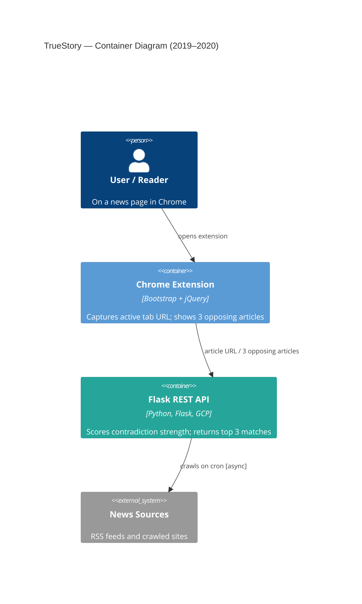

# TrueStory — Container Diagram (2019–2020)

```mermaid
C4Container
  title TrueStory — Container Diagram (2019–2020)

  Person(user, "User / Reader", "On a news page in Chrome")
  Container(ext, "Chrome Extension", "Bootstrap + jQuery", "Captures active tab URL; shows 3 opposing articles")
  Container(api, "Flask REST API", "Python, Flask, GCP", "Scores contradiction strength; returns top 3 matches")
  System_Ext(news, "News Sources", "RSS feeds and crawled sites")

  Rel(user, ext, "opens extension")
  Rel(ext, api, "article URL / 3 opposing articles")
  Rel(api, news, "crawls on cron [async]")

  UpdateElementStyle(ext, $fontColor="#FFFFFF", $bgColor="#5B9BD5", $borderColor="#3C7FC0")
  UpdateElementStyle(api, $fontColor="#FFFFFF", $bgColor="#26A69A", $borderColor="#00897B")

  UpdateLayoutConfig($c4ShapeInRow="2", $c4BoundaryInRow="1")
```
