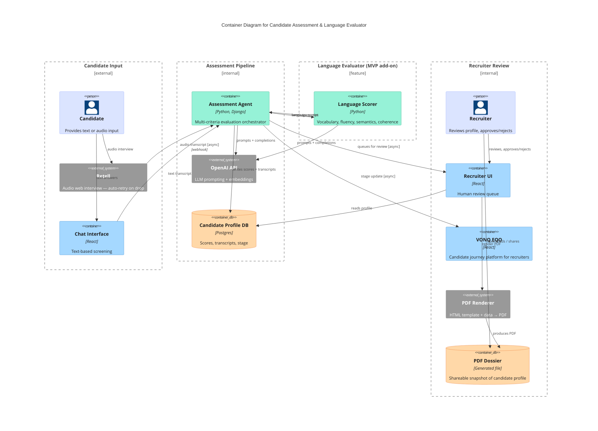

# Candidate Assessment & Language Evaluator — Container Diagram (2025–2026)

<!-- Abstraction level: Container (C4)
     Four boundaries force a LR column layout: input | pipeline | lang-eval | review.
     Plain Rel() only throughout — no directional hints (layout-001).
     Two separate agent↔scorer arrows are intentional: emphasise the additive feature split.
-->

