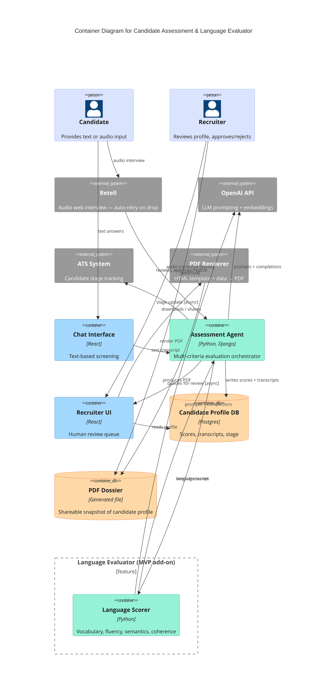

# Candidate Assessment & Language Evaluator — Container Diagram (2025–2026)

<!-- Abstraction level: Container (C4)
     LR pipeline: candidate inputs → assessment → recruiter review → PDF output.
     scorer is wrapped in a Boundary to visually separate the Language Evaluator MVP add-on.
     Plain Rel() only — no directional hints, so the Boundary renders cleanly (layout-001).
     Two separate agent↔scorer arrows are intentional: they emphasize the additive feature split.
-->

