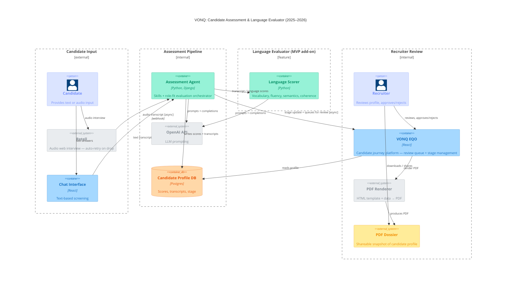

# VONQ: Candidate Assessment & Language Evaluator (2025–2026) / Container Diagram

<!-- Abstraction level: Container (C4)
     Four boundaries force a LR column layout: input | pipeline | lang-eval | review.
     Plain Rel() only throughout — no directional hints (layout-001).
     Single combined arrow between agent and scorer — sync req/resp, boundary already shows the feature split.
-->

