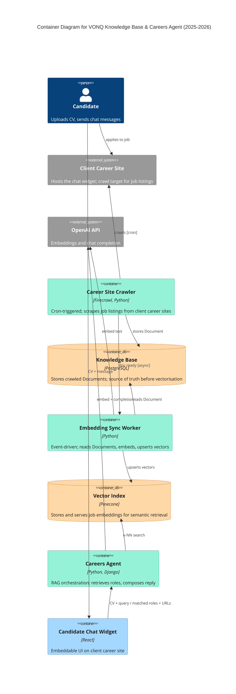

# Knowledge Base & Careers Agent — Container Diagram (2025-2026)

Two-lane RAG pipeline: a cron-triggered Career Site Crawler scrapes client career pages,
stores Documents in a Postgres Knowledge Base, and publishes events that drive an async
Embedding Sync Worker to embed via OpenAI and upsert into the Vector Index (Pinecone).
On the chat lane, a candidate interacts with a React widget embedded on the client's site;
the Careers Agent embeds the query with the same OpenAI model, runs k-NN retrieval against
the Vector Index, and feeds the results into a chat completion call to return matched roles.
The candidate then navigates directly to the job URL on the client career site.

Design notes that Mermaid C4 cannot fully render (preserved for the Excalidraw pass):
- The Candidate Chat Widget is embedded inside the Client Career Site, not on a VONQ
  domain. In Excalidraw, wrap `widget` in a boundary labeled "Embedded on client career
  site" using the bronze boundary tint (#eaddd7 / #846358).
- Two distinct flows share the Vector Index: the async crawl-and-index lane (top) and
  the sync chat lane (bottom). Keep them visually separated.
- Arrow styles for Excalidraw (UML 2.5 §17.4.4.1, system-design.md §9.3):
  - Sync (9 edges, default): strokeStyle "solid", endArrowhead "triangle" (closed filled)
  - Async (crawler → syncer, label [async]): strokeStyle "solid", endArrowhead "arrow" (open stick)
  - Cron (crawler → clientSite, label [cron]): strokeStyle "dashed", endArrowhead "triangle" (closed filled)
- Node fills for Excalidraw (pastel palette, text #1e1e1e):
  - Services (crawler, syncer, agent): bg #96f2d7, stroke #099268
  - Data stores (kb, pinecone): bg #ffd8a8, stroke #e8590c
  - UI (widget): bg #a5d8ff, stroke #1971c2
  - External (clientSite, openai): bg #e9ecef, stroke #868e96
- All Excalidraw elements: roughness 1, fontFamily 1 (Virgil).
- Use bound text via containerId, not inline label, per learnings/integration-001.md.

