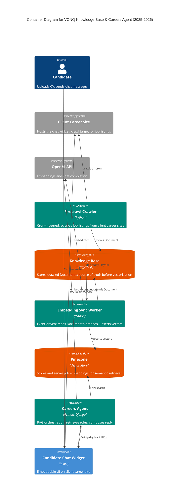

# Knowledge Base & Careers Agent — Container Diagram (2025-2026)

Two-lane RAG pipeline: a cron-triggered Firecrawl crawler scrapes client career sites,
stores Documents in a Postgres Knowledge Base, and publishes events that drive an async
Embedding Sync Worker to embed and upsert into Pinecone. On the chat lane, a candidate
interacts with a React widget embedded on the client's site; the Careers Agent runs k-NN
retrieval against Pinecone and calls OpenAI for chat completion, returning matched role
links back through the widget.

Design notes that Mermaid C4 cannot fully render (preserved for the Excalidraw pass):
- The Candidate Chat Widget is embedded inside the Client Career Site, not on a VONQ
  domain. In Excalidraw, wrap `widget` in a boundary labeled "Embedded on client career
  site" using the bronze boundary tint.
- Two distinct flows share Pinecone as the retrieval surface: the async crawl-and-index
  lane (top) and the sync chat lane (bottom). Keep them visually separated.
- The `crawler → clientSite` edge is cron-triggered: dashed + filled arrowhead per
  docs/system-design.md §9.3 and learnings/edge-semantics-002.md.
- Async edges carry `[async]` in the label; in Excalidraw they become solid + open
  arrowheads per docs/system-design.md §9.3.
- All Excalidraw elements: `roughness: 1`, `fontFamily: 1` (Virgil).
- Use bound text via `containerId`, not inline label, per learnings/integration-001.md.

