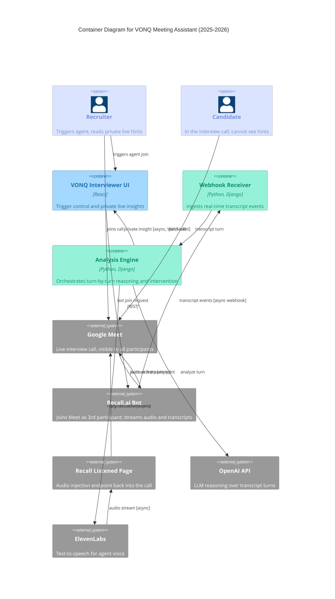

# Meeting Assistant — Container Diagram (2025-2026)

Real-time pipeline where Recall.ai joins Google Meet as a third participant, streams
transcripts into Django, OpenAI reasons turn-by-turn, and two outputs branch:
a private insight to the recruiter's VONQ UI, and an optional spoken reply injected
back into the call via ElevenLabs and Recall's Listened Page.

Design notes that Mermaid C4 cannot fully render (preserved for the Excalidraw pass):
- The private hint path (Analysis Engine → VONQ Interviewer UI) is invisible to the
  candidate. In Excalidraw, wrap that edge in a dashed "not visible to candidate"
  boundary (bronze tint #eaddd7 / #846358).
- The bot IS visible to everyone in the call (it shows up as a third participant in
  the Google Meet roster). Only the hints are private.
- Arrow styles for Excalidraw (UML 2.5 §17.4.4.1, system-design.md §9.3):
  - Sync (default): strokeStyle "solid", endArrowhead "triangle" (closed filled)
  - Async (edges labeled [async]): strokeStyle "solid", endArrowhead "arrow" (open stick)
- Node fills for Excalidraw (pastel palette, text #1e1e1e):
  - Services (ui, webhook, engine): ui bg #a5d8ff stroke #1971c2; webhook/engine bg #96f2d7 stroke #099268
  - External (meet, bot, listened, openai, tts): bg #e9ecef, stroke #868e96
- All Excalidraw elements: roughness 1, fontFamily 1 (Virgil).
- Use bound text via containerId, not inline label, per learnings/integration-001.md.

